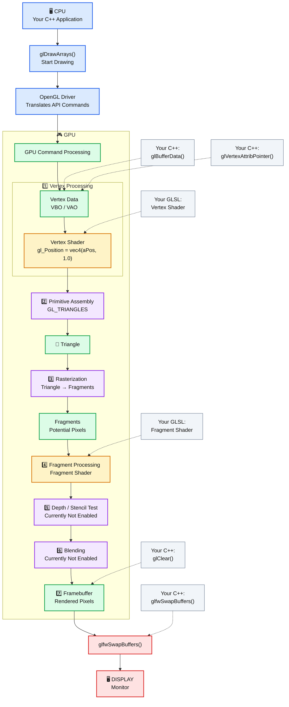

# OpenGL

# Start with Flag Rendering

// 1. Put vertex data in GPU memory
glBufferData(...);

// 2. Tell GPU how to interpret it
glVertexAttribPointer(...);

// 3. Tell GPU which shaders to use
glUseProgram(shaderProgram);

// 4. Tell GPU which vertex data to use
glBindVertexArray(VAO);

// 5. START THE GPU WORK
glDrawArrays(GL_TRIANGLES, 0, 3);

// 6. Show the completed frame
glfwSwapBuffers(window);

## OpenGL Rendering Pipeline

